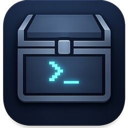
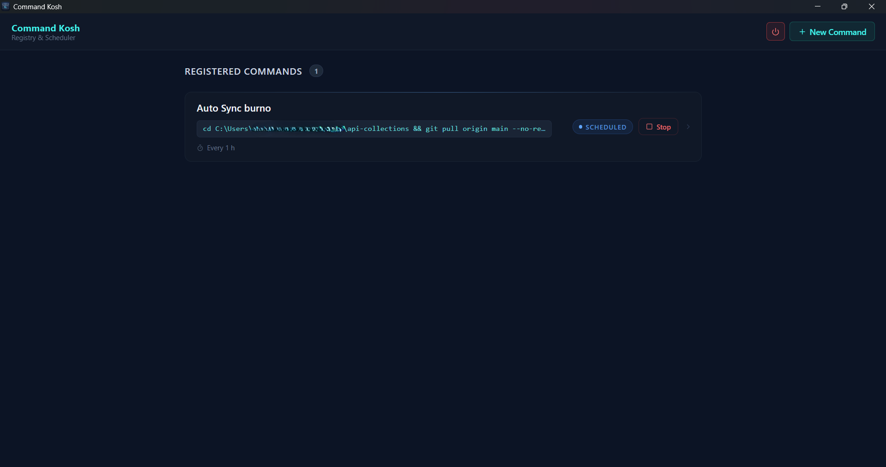
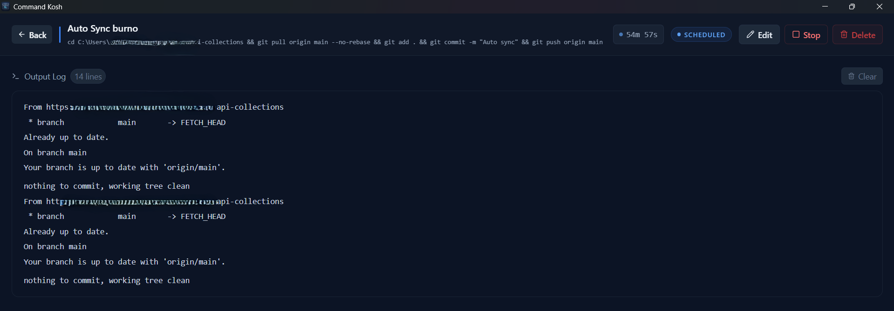
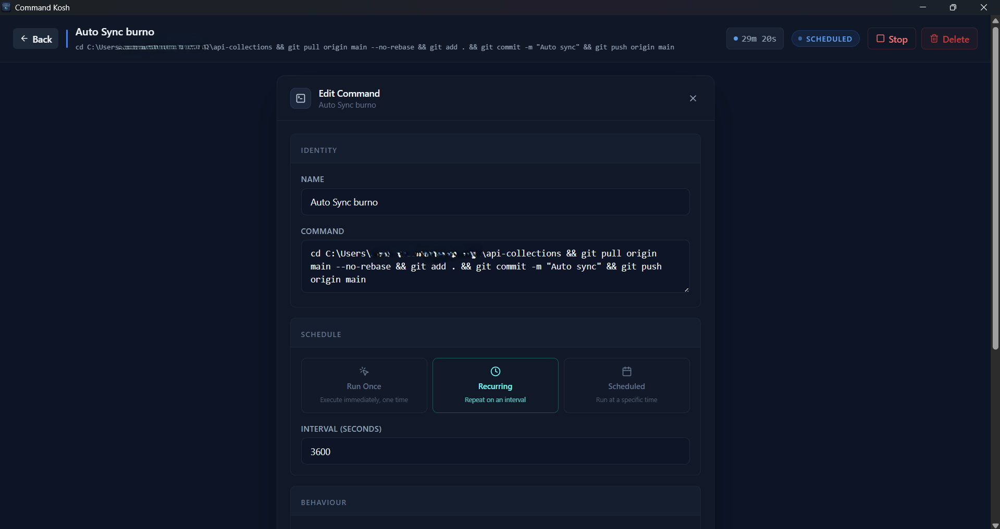
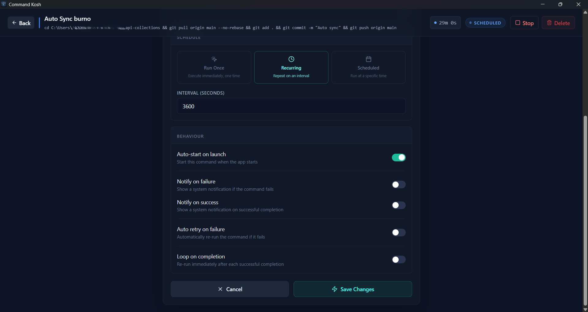
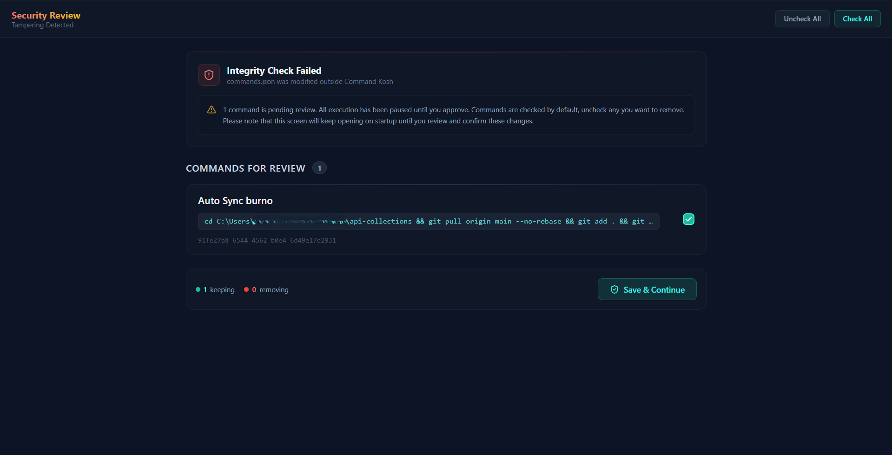

<div align="center">
  
  <br/>
  <strong style="font-size: 2em;">Command Kosh</strong>
  <br/>
  <p>A vault for your terminal commands and automate it</p>
</div>

---

## Table of Contents

- [What is Command Kosh?](#what-is-command-kosh)
- [Features](#features)
- [How the Idea Came About](#how-the-idea-came-about)
- [How It Was Built](#how-it-was-built)
- [Platform Support](#platform-support)
- [Getting Started (Development)](#getting-started-development)
- [Contributing](#contributing)
- [Screenshots](#screenshots)

---

## What is Command Kosh?

If you've ever found yourself digging through shell history, hunting down a script buried in some folder, or trying to remember the exact flags for a command you run once a month, Command Kosh was built for that problem.

It acts as a bridge between manual terminal work and full-scale automation. You store your commands in one place, and when you need to run one, you just run it. No syntax hunting, no context switching. Whether you're a developer juggling deployment scripts or a sysadmin keeping backups on schedule, everything lives in one location.

Command Kosh is built with [Tauri](https://tauri.app/), which means it has a very small memory footprint. When you close the window, it doesn't disappear. It stays running as a lightweight Rust process in your system tray, ready when you need it.

---

## Features

- **Command Vault:** Store all your commands and snippets in one place.
- **One-Click Execution:** Run any stored command instantly through the built-in runner.
- **Scheduling:** Set commands to run at fixed intervals automatically, without having to remember to do it yourself.
- **System Tray Mode:** Minimal resource usage. Close the window and the app keeps running quietly in the background as a lightweight Rust backend.

## How the Idea Came About

It started with a folder called `mytool` added to the system's PATH, where each `.bat` file would essentially become its own command. It worked, but every time a new command was needed, a new file had to be created, dropped in the right place, and named correctly. Scheduling was even worse since there was no clean way to handle it from there, nor a flexible way to see if it was actually working or not, especially after booting the system.

The scheduling feature specifically came out of a real need. The goal was to have tools like Bruno automatically push and pull changes at set times, without having to think about it every day. Command Kosh turned that into a few clicks instead of a manual process, and you know, UI always wins over the command line, even if you are a developer, at least for me.

---

## How It Was Built

Command Kosh is built with [Tauri](https://tauri.app/) because you know we developers care about memory consumption by software and it was the best fit for this project :) 

It was built in almost 15 days, after office hours and weekends, with the help of AI and almost no prior Rust experience.

### Security and Storage

Every save generates an HMAC-SHA256 signature stored in a separate `.sig` file. The signing key is kept in your OS's native keyring, never on disk as a plain file. On every launch, the app verifies the command file against the signature and blocks execution if anything doesn't match.

---

## Platform Support

Command Kosh supports **Windows, macOS, and Linux**. Development and testing has been done primarily on Windows, so macOS and Linux haven't been as thoroughly tested yet. If you're running on one of those platforms and run into issues, contributions are very welcome. See [Contributing](#contributing) below.

---

## Getting Started (Development)

### Prerequisites

You'll need the following installed:

- **Node.js** (latest LTS recommended): [nodejs.org](https://nodejs.org/en/download)
- **Rust** (via the official toolchain manager): [rustup.rs](https://rustup.rs/)

### Setup

Clone the repository, then install the JavaScript dependencies:

```bash
npm install
```

### Running in Dev Mode

```bash
npm run tauri dev
```

This opens the Command Kosh window with live reloading enabled. Any changes you make to the frontend will reflect in real time.

---

## Contributing

Contributions are welcome, especially around macOS and Linux support. To get started:

1. Fork the repository.
2. Make your changes in your fork.
3. Open a Pull Request for review.

If you find a bug or have an idea for a new feature, feel free to open an issue. Thanks for checking out Command Kosh.

---

## Screenshots

**Command Vault**


**Command Output**


**Add / Editing a Command**




**External Command Detection**


---